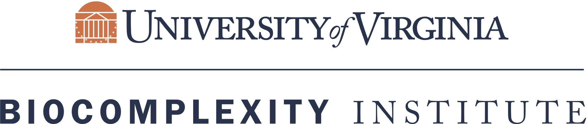

 

### About the Institute

Broadly we can define business innovation as the process of creating new or improved changes in business. Following the international guidelines for surveys of business innovation in the Oslo Manual developed by the Organization for Economic Co-operation and Development (OECD) and Eurostat, any business innovation can be categorized as a product innovation, a business process innovation, a marketing innovation or an organizational innovation. A product innovation implies introduction of a new or improved product to the market, whereas a business process innovation indicates a new or significantly improved production or delivery method. The marketing innovation includes a new marketing method and organizational innovation implies a new organizational method in business practices. Business innovation is crucial for value creation which can be achieved by introduction of new or improved products in the market, on the other hand process innovation may lead to greater productivity, and thus business innovation serves as an indicator of growth in an economy.

The National Science for Engineering and Statistics collects data related to innovation in their annual Business R&D and Innovation Survey (BRDIS). The survey aims to capture the state of innovation in the United States as defined by the 2018 Oslo Manual — any new or improved product available on the market. However, additional methods of measuring innovation can help provide further indication as to the nation’s degree of innovation. Partnering with NCSES, SDAD aims to see if non-traditional data-sources can help supplement BRDIS and aid in measuring innovation.

In the ten weeks of the DSPG program, the Business Innovation team focused on implementing the data science framework to detect innovation in text data using natural language processing and machine learning techniques. We experimented with various classification models to most accurately identify innovation in our text data, and implemented named-entity-recognition to extract company and product names from the articles presenting innovation. Additionally, we analyzed the co-mention of companies in articles through network analysis, and consolidated our findings in this dashboard.

  

### About the Division
The Social and Decision Analytics Division (SDAD) is one of three research divisions within the Biocomplexity Institute and Initiative at the University of Virginia. SDAD combines expertise in statistics and social and behavioral sciences to develop evidence-based research and quantitative methods to inform policy decision-making and evaluation. The researchers at SDAD span many disciplines including statistics, economics, sociology, psychology, political science, policy, health IT, public health, program evaluation, and data science. The SDAD office is located near our nation's capital in Arlington, VA. You can learn more about us here.

### About the Summer

The Data Science for the Public Good (DSPG) Young Scholars program is a summer immersive program held at SDAD. Entering its eighth year, the program engages students from across the country to work together on projects that address state, federal, and local government challenges around critical social issues relevant in the world today. DSPG young scholars conduct research at the intersection of statistics, computation, and the social sciences to determine how information generated within every community can be leveraged to improve quality of life and inform public policy.

### Contact Us 

