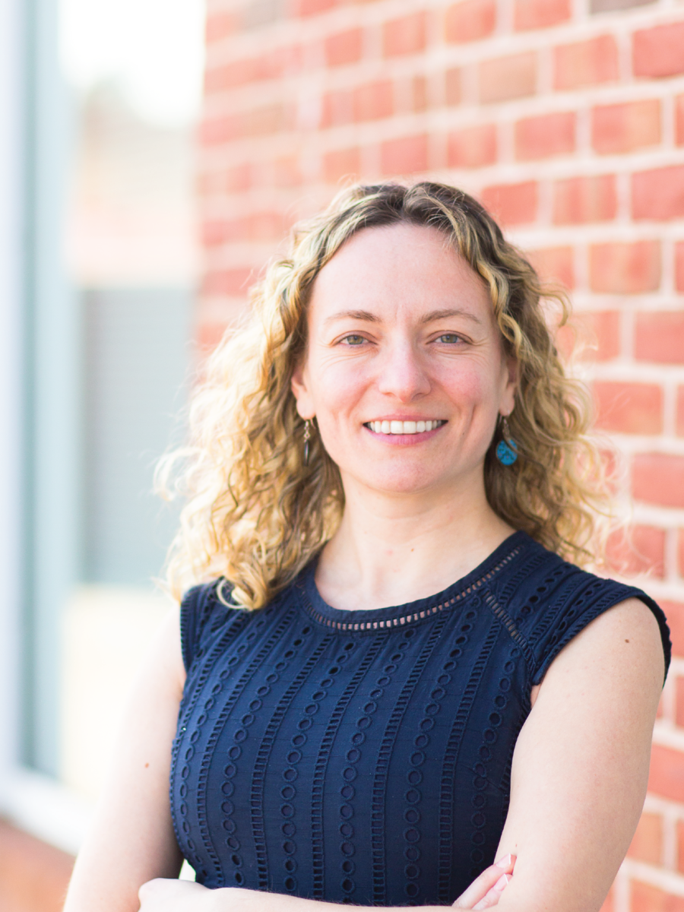
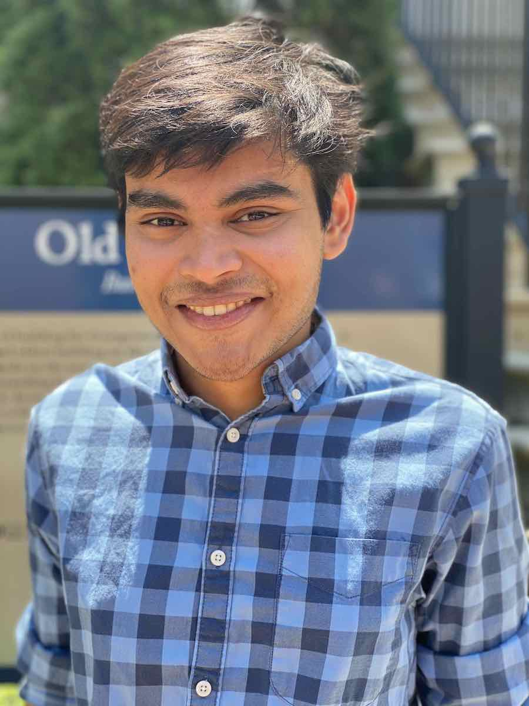
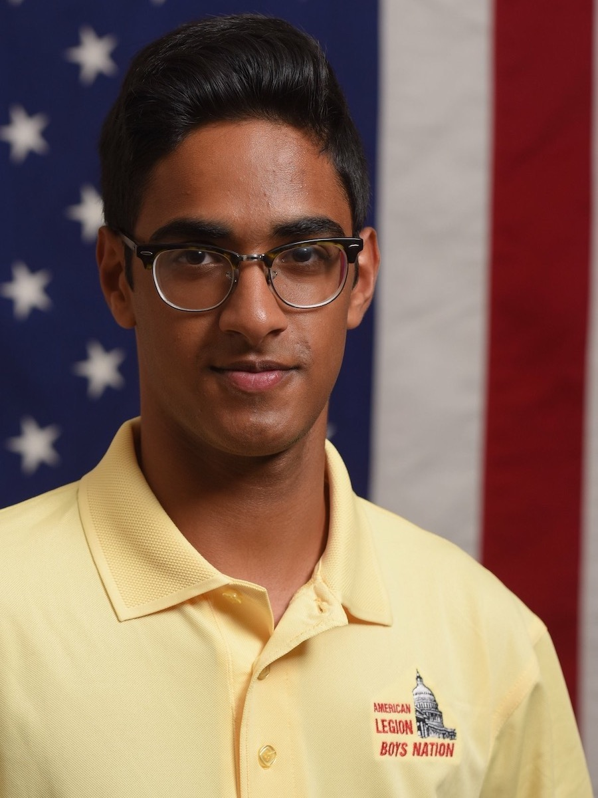

```{js echo=FALSE}
   document.getElementsByTagName('a')[0].innerHTML = ''
   document.getElementsByClassName('navbar-header')[0].style = 'margin-top:-10px;'
```

### About the Institute  

<center></center> 

At the Biocomplexity Institute and Initiative, our award-winning scientists have been searching for answers to life’s mysteries and society's most urgent problems for more than two decades. Biocomplexity is the study of life and its environment as complex systems driven by the interactions between their many components. Drawing on expertise from across the sciences, biocomplexity research offers a new way of seeing the living world that can help solve some of humanity’s toughest problems.  

When we first opened our doors in the year 2000, we were already grounded in mathematical and computational science. We knew that just as the microscope revolutionized medicine in the 16th century, in this century data-driven exploration and discovery will enhance human well-being. We also understood that with the rapid expansion of computing power, we could — and must — address the actual complexity of the world we live in. And we knew that by working with partners on real problems facing humanity, we could help steer a healthier and safer future. In 2018, with a history of innovative research, successful partnerships, and millions of dollars in research funding, the Biocomplexity Institute was invited to take up residence at the University of Virginia. We share the university’s vision: reaching for great to do good in the world.  

### Our Team  

#### SDAD - Social and Decision Analytics Division  

|  |  |  |
| :-------------: | :----------: | :-----------: |
| [Devika Mahoney-Nair](https://github.com/DevikaNair90) | [Gizem Korkmaz](https://github.com/gkorkmaz) | [Neil Alexander](https://github.com/neilalex) |  

#### DSPG - Data Science for Public Good  

|  |  |  |
| :-------------: | :----------: | :-----------: |
| [Digvijay Ghotane<br>(Fellow)](https://www.digvijayghotane.com) | [Akilesh Ramakrishna<br>(Intern)](https://github.com/asr8r) | [Aditi Mahabal<br>(Intern)](https://www.linkedin.com/in/aditimahabal) |  

#### Sponsor  

[Gary Anderson, National Science Foundation (NSF), National Center for Science and Engineering (NCSES)](https://www.nsf.gov/staff/staff_bio.jsp?lan=ganderso&org=NSF&from_org=)  
  

### About the Division  

The Social and Decision Analytics Division (SDAD) is one of three research divisions within the Biocomplexity Institute and Initiative at the University of Virginia. SDAD combines expertise in statistics and social and behavioral sciences to develop evidence-based research and quantitative methods to inform policy decision-making and evaluation. The researchers at SDAD span many disciplines including statistics, economics, sociology, psychology, political science, policy, health IT, public health, program evaluation, and data science. The SDAD office is located near our nation's capital in Arlington, VA. You can learn more about us here.  


### About the Summer  

The Data Science for the Public Good (DSPG) Young Scholars program is a summer immersive program held at SDAD. Entering its eighth year, the program engages students from across the country to work together on projects that address state, federal, and local government challenges around critical social issues relevant in the world today. DSPG young scholars conduct research at the intersection of statistics, computation, and the social sciences to determine how information generated within every community can be leveraged to improve quality of life and inform public policy.  