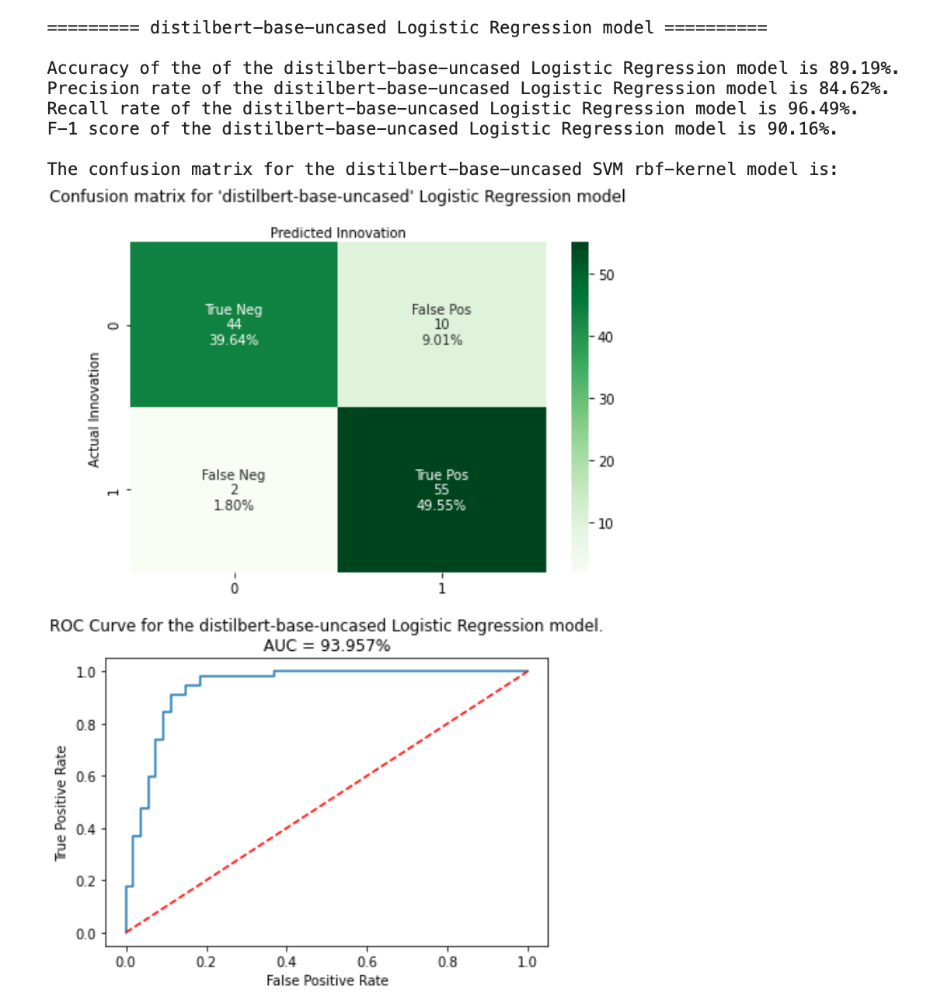
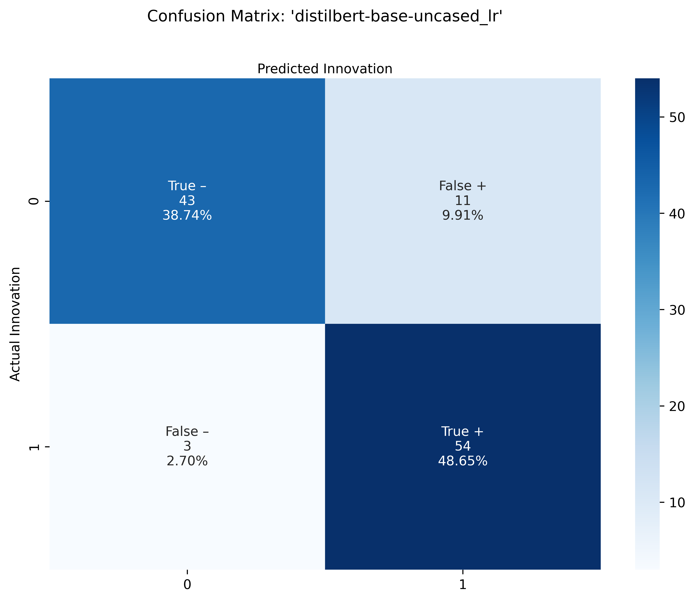
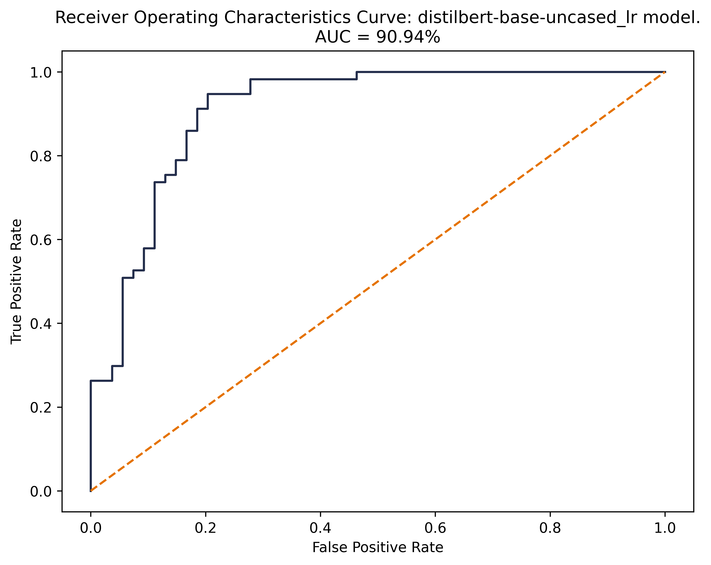
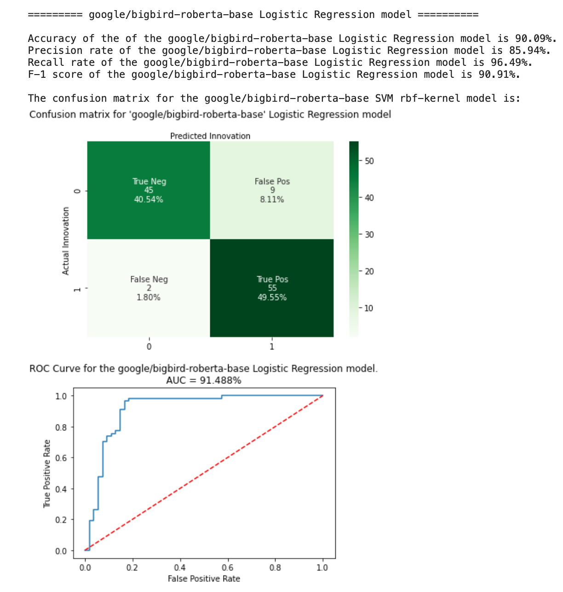
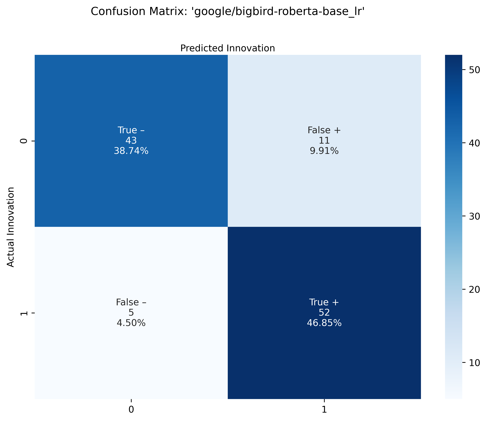
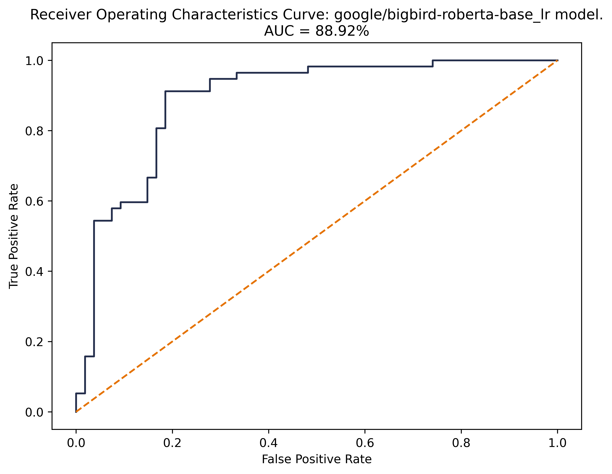

```{js echo=FALSE}
   document.getElementsByTagName('a')[0].innerHTML = ''
   document.getElementsByClassName('navbar-header')[0].style = 'margin-top:-10px;'
```

<style>
  .col2 {
    columns: 2 200px;         /* number of columns and width in pixels*/
    -webkit-columns: 2 200px; /* chrome, safari */
    -moz-columns: 2 200px;    /* firefox */
  }
</style>

<div class="col2">
<br>
<br>
</div>


## HuggingFace.io

BERT Implementation Notes

All of the methods described above were implemented in python using the [transformers](https://huggingface.co/transformers/) library for pre-processing, classification, and named entity recognition. HuggingFace is a leading natural language processing startup that uses Transformers to solve sequence-to-sequence tasks while handling long-range dependencies with ease. HuggingFace/Transformers is a python-based library that exposes an API to use many well-known transformer architectures, such as BERT, RoBERTa, GPT-2 or DistilBERT, that obtain state-of-the-art results on a variety of NLP tasks like text classification, information extraction, question answering, and text generation. Those architectures come pre-trained with several sets of weights.

## Additional Model Results: 2nd Place & Runner Up

#### Distil-BERT Logistic Regression  

<!--  -->

<div class="col2">



<br>
<br>




</div>

#### BigBird Logistic Regression  

<!--  -->

<div class="col2">



<br>
<br>


</div>

