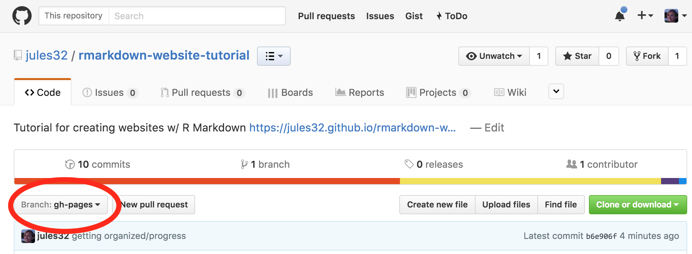

----

## Traditional Methods to Measure Innovation

* OSLO definition
* OECD
* BRDIS/ABS by NSF NCSES

We can broadly define "business innovation" as the process of creating new or improved changes in business. Following the international guidelines for surveys of business innovation in the OSLO Manual, developed by the Organization for Economic Co-operation and Development (OECD) and Eurostat, any business innovation can be categorized either as a: product innovation, business process innovation, marketing innovation, or organizational innovation. A product innovation implies the introduction of a new or improved product to the market, whereas a business process innovation indicates a new or significantly improved production or delivery method. A marketing innovation includes a new marketing method and an organizational innovation describes a new organizational method in business practices. Business innovation is crucial for value creation which can be achieved by the introduction of new or improved products in the market, and on the other hand, process innovation may lead to greater productivity and efficiency. As a key indicator of growth in the economy, accurately gauging the extent of Business innovation is of crucial importance for policy makers.

Traditional efforts to measure innovation in the United States primarily inlcude the National Center for Science and Engineering Statistics (NCSES) annual [Business R&D and Innovation Survey (BRDIS)](https://www.nsf.gov/statistics/srvyberd/). The survey aims to capture the state of innovation in the United States through a nationally representative sample of non-farm businesses across the country that asks if businesses have innovated in the past year, as defined by the 2018 Oslo Manual — any new or improved product available on the market. However, additional methods of measuring innovation can help provide further indication as to the nation’s degree of innovation. Partnering with NCSES, SDAD aims to see if non-traditional data-sources can help supplement BRDIS and aid in measuring innovation.

<!---How do i mention the NSF in relation to the NSCES and BRDIS? Hyperlink goes to BERD from last year's website? --->

 

## Data Sources

* About dow jones dna
* high level profiling
* labeling & training data

###Dow Jones News and Analytics (DNA)

The Dow Jones DNA platform collects information from Dow Jones publication with premium and licensed third party sources. This proprietary data platform contains 1.3bn articles each labeled with unique DNA taxonomies tags including word count, source name, and company code. More information on all the included data tags can be found on the DNA website. This dataset served as the primary resource for alternative text sources and will inspire the machine learning algorithms that will predict innovation.

###High level Profiling
The end goal of our project includes implementing our classification and NER models on a year's worth of articles from the DNA database, specifcally in the software industry. The graphics below provide a high level overview of the 2017 data.
Graphics for: 
how many articles in 2017 for computer software: 101,143
How many publishers: 825 
Top 10 company codes about:

###Labeling & Training Data
In order to train our BERT classification model for the purposes of predicting whether an article from the DNA database described an innovation or not, we first had to hand label a subset of 600 DNA articles. In preparation for this, our team reviewed the OSLO Manual, which as aforementioned, defines innovation, and provides the basis for collecting and reporting innovation data and publishing statistics on business innovation.

Our classification entailed not only labeling articles if they described an innovation or not, but several other fields that would later help fine tune our algorithm and yield data we could use for the purposes of Named Entity Recognition (NER). Specifically, if we classified an articles as a "yes" for innovation, we then also labeled the company name(s), where the name(s) was mentioned (title, snippet, and/or body), what the product name was, where it was mentioned, any tags on the product name if they existed (such as "TM" or "C" that could help tune our algorithm), and finally, what the features of the product were.

Only after finishing this task of hand-labeling 600 news articles, our team was then able to begin implementing Natural Language Processing methods, specifically the transformer-based BERT, to begin training our model on classification.

----  

----  

----  
  
`github.io` means that there is a Github repo behind this website, and we also know the username and repo name:

**<http://jules32.github.io/rmarkdown-website-tutorial>** <=> **<https://github.com/jules32/rmarkdown-website-tutorial>** 

(Note: you can have github websites point to different urls if you don't want the `github.io`.)

 

### The website's repo

Let's go to **<https://github.com/jules32/rmarkdown-website-tutorial>**.  
  
**First, note the `gh-pages` branch** - this is critical for building free webpages. You can usually name branches whatever you want, but the `gh-pages` name means it can be built as a website. [I set it as my default branch](https://help.github.com/articles/setting-the-default-branch/).

 

**Now let's look at the filenames**. We can recognize the names of the webpages we've seen, and there is also a `_site.yml` file, which is the website's configuration file. The simplest website possible would have 2 files only: `_site.yml` and `index.Rmd`

 

## Fork to your account, clone to your computer

Let's start digging deeper and playing with this.  

1. Fork the [jules32/rmarkdown-website-tutorial](https://github.com/jules32/rmarkdown-website-tutorial) repo into your own account. 

2. Edit the URL for the website by replacing `jules32` with your GitHub username

3. Clone to your local computer using RStudio (preferred) the [Desktop App](https://desktop.github.com/), or the command line.

