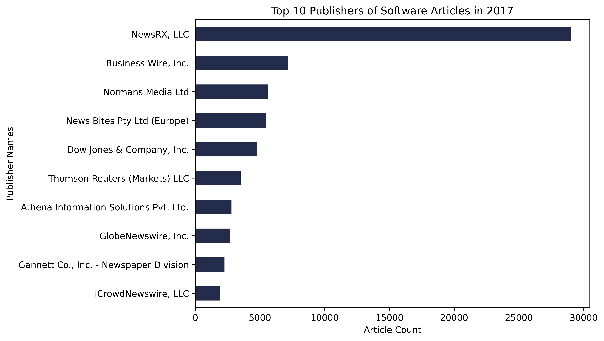
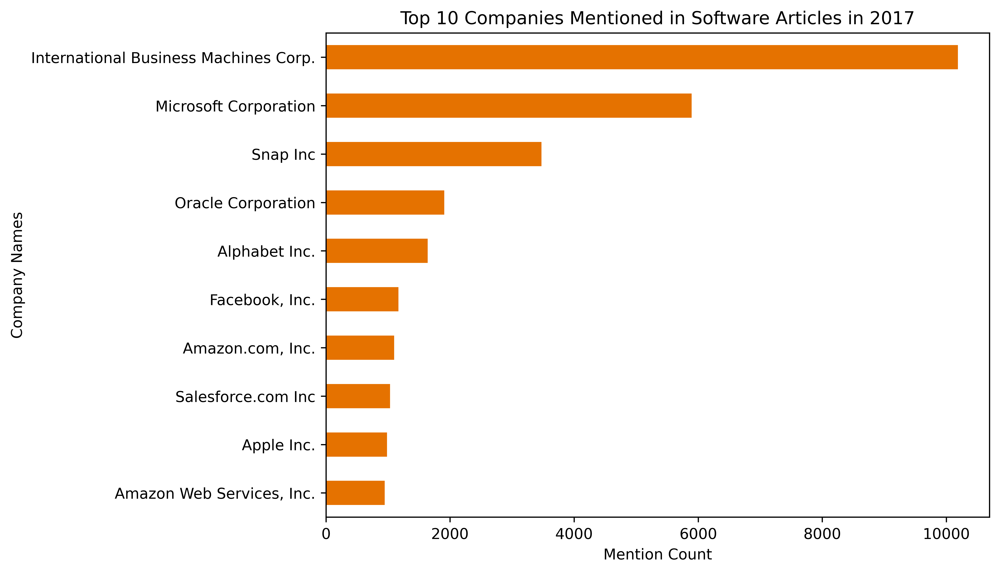
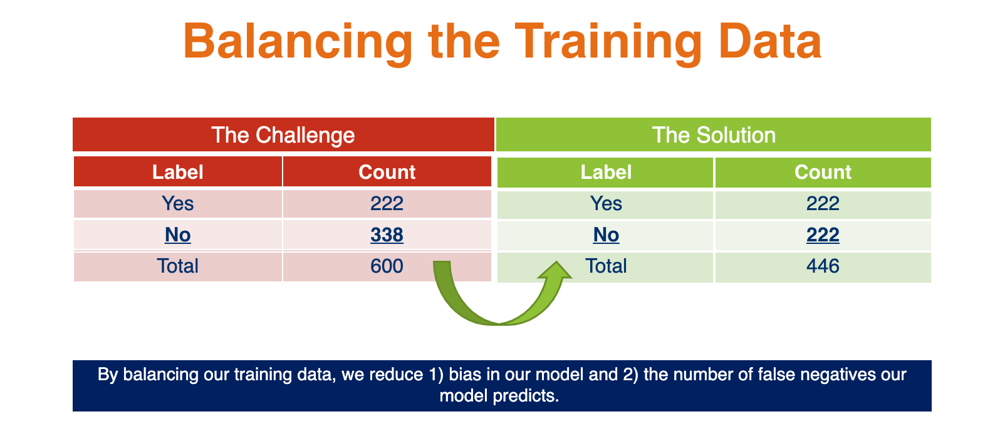

<style>
  .col2 {
    columns: 2 200px;         /* number of columns and width in pixels*/
    -webkit-columns: 2 200px; /* chrome, safari */
    -moz-columns: 2 200px;    /* firefox */
  }
</style>

### **Traditional Methods to Measure Innovation**  

We can broadly define 'Business Innovation' as the process of creating new or improved changes in the business. Following the international guidelines for surveys of business innovation in the OSLO Manual, developed by the Organization for Economic Co-operation and Development (OECD) and Eurostat, any business innovation can be categorized either as a: product innovation, business process innovation, marketing innovation, or organizational innovation. The most common type of innovation discussed within text sources, product innovation, implies that a new or improved product is introduced to the market. Measuring product innovation is specifically our focus for summer. Business innovation is crucial for value creation which can be achieved by the introduction of new or improved products in the market. As a key indicator of growth in the economy, accurately gauging the extent of business innovation is of crucial importance for policymakers.  

Traditional efforts to measure innovation in the United States primarily include the two surveys conducted by National Science Foundation’s (NSF) division – the [National Center for Science and Engineering Statistics (NCSES)](https://www.nsf.gov/statistics/about-ncses.cfm): [Business R&D and Innovation Survey (BRDIS)](https://www.nsf.gov/statistics/srvyberd/), and the [Annual Business Survey (ABS)](https://www.nsf.gov/statistics/srvyabs/). The surveys aim to capture the state of innovation in the United States through a nationally representative sample of non-farm businesses across the country. These surveys aim to collect data on innovation by companies in the past year, as defined by the 2018 Oslo Manual — any new or improved product available on the market. However, additional methods of measuring innovation can help provide further information on the nation’s degree of innovation.  

Partnering with NCSES, SDAD aims to see if non-traditional data sources can help supplement BRDIS by measuring innovation. Our main goals for the summer were:  

1. Understanding the degree of identification of innovation within text sources, specifically news articles by text classification algorithms;  
2. Determining the innovative companies within the relevant industry sector from the classified text.  

----

### **The Data**   

#### DowJones News and Analytics (DNA)  

<div class="col2">
<center></center>  

<br>
<br>
<br>
<br>

The Dow Jones DNA platform collects information from Dow Jones publications with premium and licensed third-party sources. This proprietary data platform contains 1.3bn news articles each labeled with unique DNA taxonomies tags including word count, source name, and company code. More information on all the included data tags can be found on the DNA website. This dataset served as the primary resource for alternative text sources and will inspire the machine learning algorithms that will predict innovation. 

</div>
----

#### High level Profiling  

The end goal of our project included implementing our classification and NER models on a year's worth of articles from the DNA database, specifcally in the software industry. The graphics below provide a high level overview of the 2017 data.  

| Measure             | n       |
|---------------------|---------|
| Total 2017 articles | 101,143 |
| Total publishers    | 825     |
| Total companies     | 11,537  |

<br>

These figures below describe the 2017 data by providing counts of the top ten publishers and the the top ten companies mentioned in the 2017 Software Articles. 

<center></center>  

Observing the publishers graph, we see that the articles are dominated by the publisher NewsRX, LLC. With their article count at almost 30,000, they account for close to a third of all the articles we used in our analysis. This outsized representation of NewsRX, LLC plays a large role in our analysis as our results will reflect the coverage of this publisher, and not to mention the  other well represented publishers, including factors such as: how they cover the software industry, the scope of their reporting, and what companies they report on.


<center></center>  

This last aspect is reflected in the top ten companies mentioned graph. Across all of the publishers, we can see which companies in the software industry receive the most coverage within the Dow Jones DNA data. The top three companies in this case are IBM, Microsoft, and Snap. Interestingly, we can see how larger trends at the time of these articles publishing are reflected in these company mention counts. Most of the top ten companies in this list are fairly large and established software companies, with a long-standing record of performance within the industry. However, we can also observe how social and cultural factors play a role, as Snap, albeit a company that is much smaller to its counterparts on the list, received more coverage than all but two companies within the industry.

----

#### Labeling Task

We trained various classification models based on transformers-based machine learning NLP models, for example, BERT, distil-BERT, BigBird, RoBERTa. The models predict whether an article from the DNA database described a product innovation or not. For this purpose, we hand-labeled a subset of 600 DNA articles. In preparation for this, our team reviewed the OSLO Manual, which as aforementioned, defines product innovation and provides the basis for collecting and reporting innovation data and publishing statistics on business innovation.  

We chose 600 articles at random from the database of articles. Our exploratory data analysis on these articles firstly entailed creating a field that distinguished articles if they described an innovation or not. We also added several other fields that we use for Named Entity Recognition (NER). Specifically, if we classified articles as a "yes" for innovation, we then also labeled the company name(s), where the name(s) was mentioned (title, snippet, and/or body), what the product name was, where it was mentioned, any tags on the product name if they existed (such as "TM" or "C" that could help tune our algorithm), and finally, what the features of the product were.  

An example of our data is shown below:  

```{r echo=FALSE, message=FALSE, warning=FALSE, error = F}
library(tidyverse)
library(readxl)
require(xtable)
data <- readxl::read_excel("classification_example.xlsx")
preview <- data[1,c("title", colnames(data)[6:7])] 
colnames(preview) <- c("Headline", "Innovation/New Product Indicated?", "Company Name")
preview %>% knitr::kable(format = "html")
```
  
<br> 
This example above highlights the relevant components of our labeling framework our team used to classify articles and produce training data. Based on the headline, we can label the article as a "yes" for innovation as it describes a new or improved product that is available on market, the QT AI Camera, now, with COVID-19 Enhancements. Furthermore, we also see a text signal that strongly indicates this article describes an innovation: the word "Launches." Based on our definition of innovation from the Oslo Manual, again, “a new or significantly improved product that is available on market,” we often see article headlines that contain the word "launch" to denote an innovation. After making this determination on innovation, we then labeled the company name, "Dragontail Systems," and subsequently, filled out the remaining of the aforementioned columns, like where the company name was mentioned, and so on.


----
  
#### Our Training Set  

After hand-labeling 600 news articles, our team was then able to begin implementing transformer-based Natural Language Processing (NLP) methods to begin training our models for classification. However, prior to implementation, one last step was required: balancing our training data. Of the 600 articles we classified, 222 articles described an innovation. This imbalance in our dataset would translate to a bias in our model toward classifying an article as not describing an innovation. Thus, we chose a balanced set to train our model. We did so by subsetting our "no" innovation articles to a random 222 article sample thus having a balanced dataset of 444 rows.  


<center></center>  
