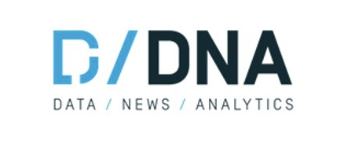
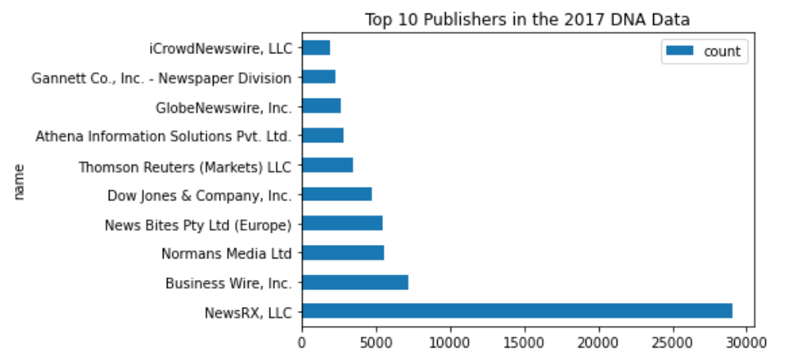
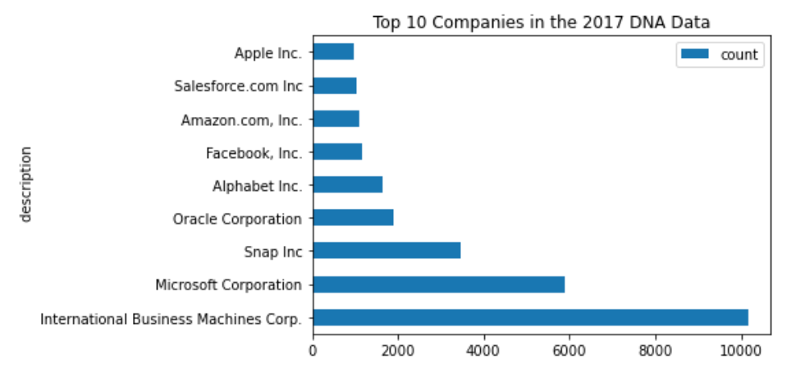

----

## Traditional Methods to Measure Innovation

We can broadly define "business innovation" as the process of creating new or improved changes in business. Following the international guidelines for surveys of business innovation in the OSLO Manual, developed by the Organization for Economic Co-operation and Development (OECD) and Eurostat, any business innovation can be categorized either as a: product innovation, business process innovation, marketing innovation, or organizational innovation. A product innovation, most commonly the innovation discussed within text sources, implies the introduction of a new or improved product to the market. Business innovation is crucial for value creation which can be achieved by the introduction of new or improved products in the market. As a key indicator of growth in the economy, accurately gauging the extent of business innovation is of crucial importance for policymakers.

Traditional efforts to measure innovation in the United States primarily include the National Science Foundation's (NSF) division the National Center for Science and Engineering Statistics (NCSES) [Business R&D and Innovation Survey (BRDIS)](https://www.nsf.gov/statistics/srvyberd/) and the [Annual Business Survey (ABS)](https://www.nsf.gov/statistics/srvyabs/). The surveys aim to capture the state of innovation in the United States through a nationally representative sample of non-farm businesses across the country that asks if businesses have innovated in the past year, as defined by the 2018 Oslo Manual — any new or improved product available on the market. However, additional methods of measuring innovation can help provide further information as to the nation’s degree of innovation. 

Partnering with NCSES, SDAD aims to see if non-traditional data-sources can help supplement BRDIS and aid in measuring innovation. Our two main goals for the summer are firstly, understanding the degree to which innovation can be measured in text sources, such as news articles, and secondly, determining if from there we can then identify the innovative companies within the relevant industry sector. 

<!---How do i mention the NSF in relation to the NSCES and BRDIS? Hyperlink goes to BERD from last year's website? --->
<!---In addition to this survey, the annual business survey (ABS); Also: paragraph for goals of summer - understand the degree to which innovation can be measured in text sources, and from there, can we identify the companies who are innovating--->
 

## Data Sources

### Dow Jones News and Analytics (DNA)

The Dow Jones DNA platform collects information from Dow Jones publication with premium and licensed third party sources. This proprietary data platform contains 1.3bn articles each labeled with unique DNA taxonomies tags including word count, source name, and company code. More information on all the included data tags can be found on the DNA website. This dataset served as the primary resource for alternative text sources and will inspire the machine learning algorithms that will predict innovation.

### High level Profiling
The end goal of our project includes implementing our classification and NER models on a year's worth of articles from the DNA database, specifcally in the software industry. The graphics below provide a high level overview of the 2017 data.

| Measure             | n       |
|---------------------|---------|
| Total 2017 articles | 101,143 |
| Total publishers    | 825     |
| Total companies     | 11,537  |

### Labeling & Training Data

In order to train our BERT classification model for the purposes of predicting whether an article from the DNA database described an innovation or not, we first had to hand label a subset of 600 DNA articles. In preparation for this, our team reviewed the OSLO Manual, which as aforementioned, defines innovation, and provides the basis for collecting and reporting innovation data and publishing statistics on business innovation.

Our classification entailed not only labeling articles if they described an innovation or not, but several other fields that would later help fine tune our algorithm and yield data we could use for the purposes of Named Entity Recognition (NER). Specifically, if we classified an articles as a "yes" for innovation, we then also labeled the company name(s), where the name(s) was mentioned (title, snippet, and/or body), what the product name was, where it was mentioned, any tags on the product name if they existed (such as "TM" or "C" that could help tune our algorithm), and finally, what the features of the product were.

Only after finishing this task of hand-labeling 600 news articles, our team was then able to begin implementing Natural Language Processing methods, specifically the transformer-based BERT, to begin training our model on classification.

