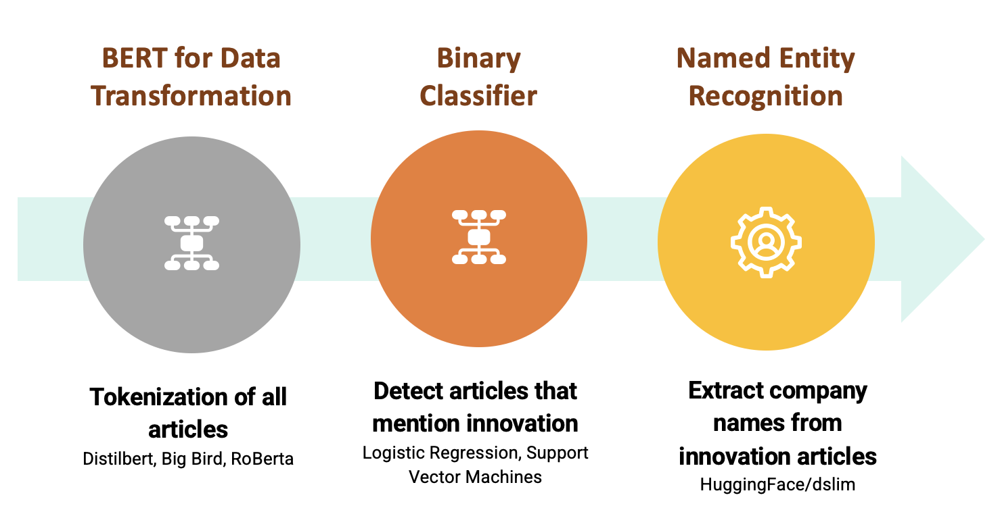

```{js echo=FALSE}
   document.getElementsByTagName('a')[0].innerHTML = ''
   document.getElementsByClassName('navbar-header')[0].style = 'margin-top:-10px;'
```
```{r echo=FALSE, error=F, message=FALSE, warning=FALSE}
library(tidyverse)
library(plotly)

data = read_csv("/project/class/bii_sdad_dspg/uva_2021/binn/dynamic_company_innov_fig_data.csv")
data = 
  data %>% 
  mutate(pct_innov = round(pct_innov*100, 2))
data = data %>% 
  head(1000) %>% 
  mutate(description = factor(description, levels = description))

fig <- plot_ly(data, 
               y = ~factor(`description`), 
               x = ~`Non-Innovative Mentions`,
               name = 'Non-Innovative Mentions',
               mode = "markers",
               marker = list(color = 'rgb(35,45,75)'),
               text = ~paste0(`description`, " had ", `All Mentions`, " mentions in 2017,<br>out of which ", `Non-Innovative Mentions`, " were non-innovation related mentions."), 
               hoverinfo = "text",
               type = 'bar')


fig <- fig %>% add_trace(x = ~`Innovative Mentions`, 
                         name = 'Innovative Mentions', 
                         mode = "markers",
                         marker = list(color = 'rgb(229,114,0)'),
                         text = ~paste0(`description`, " was mentioned ", `Innovative Mentions`, "<br>times in 2017 for innovating a new product,<br>which is ", `pct_innov`, "% of the total times it was mentioned."), 
                         hoverinfo = "text")

fig <- fig %>% layout(title = "Company Mentions in Computer Software Articles in 2017",
                      yaxis = list(title = "",
                                   tickangle = 0,
                                   type = 'category',
                                   range = c(0,10),
                                   fixedrange = F,
                                   autotick = T,
                                   automargin = T),
                      xaxis = list(title = 'Mentions',
                                   autotick = T,
                                   automargin = T,
                                   rangemode = "nonnegative"
                                   ), 
                      barmode = 'stack',
                      autosize = F, width = 700, height = 450) %>% rangeslider(., start = 0, end = (max(data$`All Mentions`)+1000))

fig 
```

### **The Problem**

The National Science for Engineering and Statistics (NCSES) within National Science Foundation (NSF) is interested in studying and understanding the national landscape of the business-sector innovation. The NSF surveys companies in order to note innovation in the respective sector. Our work this summer seeked to expand upon the work conducted by the NSF. We worked on determining additional methods to measure innovation by using non-traditional data sources. The goal was to help further illuminate incidences of national innovation within the computer software sector. Partnering with NCSES, our summer team aimed to see if alternative approaches can help supplement traditional survey data in turn, aiding in measuring innovation.  

----

### **Our Goals and Work**  

We focused on implementing the data science framework to detect innovation in text data using Natural Language Processing (NLP) techniques and machine-learning methods. Over the duration of ten weeks in Summer 2021, we experimented with and implemented:  

* highly sophisticated natural language processing approaches for tokenization,    
* classification models to identify text that described innovation, and  
* named-entity recognition models to extract company names from articles classified as innovative using our trained models.  

We were able to successfully construct a pipeline to identify text about innovation and extract innovators. Additionally, we analyzed the co-mention of companies in articles through network analysis and consolidated our findings in this dashboard.  

Ultimately, this work aims to provide NSF with an efficient way to identify innovation in real-time from text sources. Furthermore, this work allows NSF to learn the landscape of companies that indulge in innovative practices in real-time through news articles instead of the traditional survey methods.  

----

Our approach allows us greater insight into text than traditional text methods to make predictions about the highly ambiguous concept of innovation. Join us to learn more about this space, our methods, and our findings!

<center></center>  

