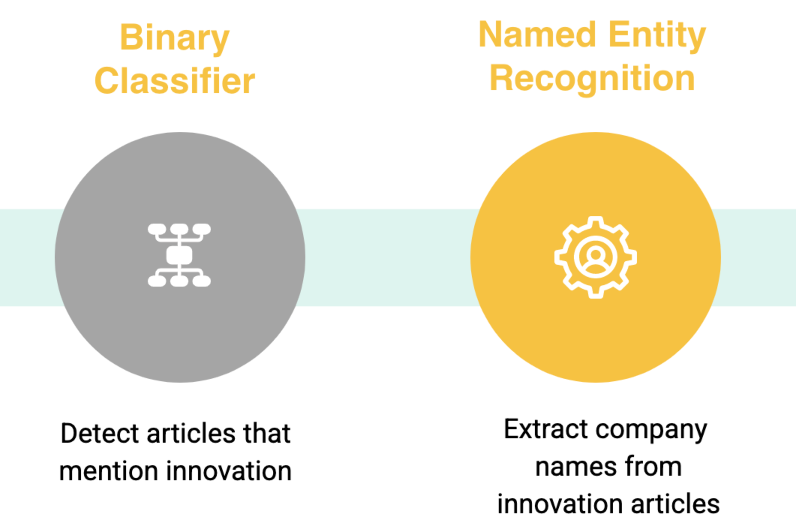

----

  

## BERT

BERT is a pre-trained, bidirectional unsupervised Natural Language Processing model developed by Google in 2018. Trained on the Book Corpus of 2,500 million words and Wikipedia's 800 million words, BERT tokenizes and builds more complex text embeddings that take word context into account, unlike traditional "bag-of-words" approaches. Here, we use BERT in a number of ways: not only as a data transformation tool to convert our text data into text embeddings based on a pretrained model, but also as the basis for named-entity recognition.

### BERT for Data Transformation

#### DistilBERT

DistlBERT is a distilled version of traditional BERT. Uses fewer parameters, which had the interesting effect in our Summer trials of improving accuracy by reducing noise. It also runs faster and is smaller in size.

#### Big Bird

Big Bird is a new State of The Art method of tokenization and language processing. This model emphasizes memory optimization to allow for longer sequences to be processed. This could help us with our current limitation where we can only process the first 512 tokens.

#### Roberta

RoBERTa and DistilRoBERTa – RoBERTa is a most robustly trained version of BERT that also uses much larger datasets to train. (160GB for RoBERTa vs 16GB for BERT). It also uses datasets to train that are more relevant to our applications, such as CC-NEWS (76G), OpenWebText (38G) and Stories (31G) data. DistilRoBERTa is a version of RoBERTa that has been processed using Knowledge Distillation, similar to DistilBERT. Once again, it has a faster performance.

### BERT for Named-Entity Recognition

#### HuggingFace/dslim-bert-base-NER

[Try the demo here!](https://huggingface.co/dslim/bert-base-NER)

## Cross-Validation

Cross-validation is a statistical method used to estimate the skill of machine learning models. This summer, we used a method of cross-validation known as “k-fold” to evaluate the skill of our BERT + classifier models, where k=10. In 10-fold cross validation, a given data set is split into 10 sections where each section/fold is used as a testing set at some point. In the first iteration, the first fold is used to test the model and the rest are used to train the model. In the second iteration, 2nd fold is used as the testing set while the rest serve as the training set. This process is repeated until each fold of the 10 folds have been used as the testing set.

  

----

## Our Approach

  

1. Implement BERT to tokenize and build text embeddings for the labeled data sets

2. Leverage Machine Learning Methods to build and train a model to identify innovative articles using labeled data sets.

3. Evaluate model performance using cross validation. 

4. Apply BERT’s Named Entity Recognition methods to extract company names from documents

5. Run these methods to all articles for a given sector for a given year to extract the count of innovative articles per year, with their associated companies.

----