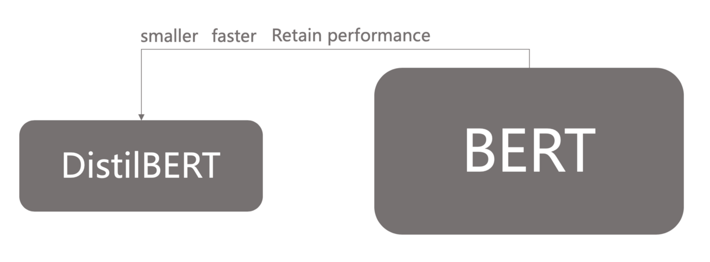
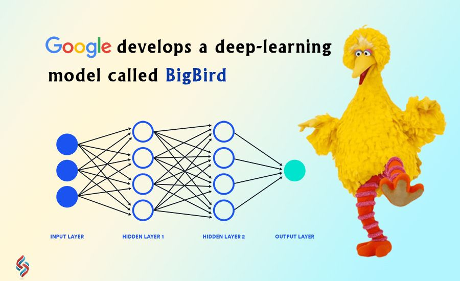
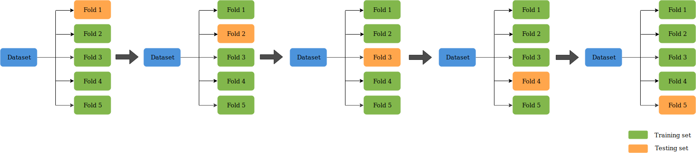

 
 

Notes: 

* Explanation of Big-Bird-Roberta as hybrid of the two (combine those sections and add a explanation of combo)
* nothing about machine learning
* NER section - bert base
* separate page for Evaluation

## **Our Approach**  

  

1. Implement various transformer based Natural Language Processing (NLP) models to tokenize and build text embeddings for the labeled data sets,  

2. Leverage supervised Machine Learning methods to train a model using a balanced dataset to classify articles denoting innovation and not denoting innovation,  

3. Evaluate model performance using cross-validation by using the imbalanced dataset,  

4. Apply BERT’s Named Entity Recognition methods to extract company names from classified documents,  

5. Run these methods to all articles for a given sector for a given year to extract the count of innovative articles per year, with their associated companies.  

----

## **Transformer Based Natural Language Processing Models**  
### BERT  

  

BERT is a pre-trained, bidirectional unsupervised Natural Language Processing model developed by Google in 2018. Trained on the Book Corpus of 2,500 million words and Wikipedia's 800 million words, BERT tokenizes and builds more complex text embeddings that take word context into account, unlike traditional "bag-of-words" approaches. Here, we use BERT in several ways: not only as a data transformation tool to convert our text data into text embeddings based on a pre-trained model for classification but also as the basis for named-entity recognition.    

There are a number of different types of BERT, usually designed to suit a specific task or optimized for a specific type of data. For the purposes of our work, these include:

#### DistilBERT

DistlBERT is a distilled version of traditional BERT. Uses fewer parameters, which had an interesting effect in our Summer trials of improving accuracy by reducing noise. It also runs faster and is smaller in size.   
 
 

  

#### Big Bird  

Big Bird is a new State of The Art method of tokenization and language processing. This model emphasizes memory optimization to allow for longer sequences to be processed. This could help us with our current limitation where we can only process the first 512 tokens. 
 
 
 

  

 

#### Roberta  

RoBERTa and DistilRoBERTa – RoBERTa is a most robustly trained version of BERT that also uses much larger datasets to train. (160GB for RoBERTa vs 16GB for BERT). It also uses datasets to train that are more relevant to our applications, such as CC-NEWS (76G), OpenWebText (38G), and Stories (31G) data. DistilRoBERTa is a version of RoBERTa that has been processed using Knowledge Distillation, similar to DistilBERT. Once again, it has faster performance.  

#### BERT Base

### How do we make use of BERT for our work?

We make use of the aforementioned models and their variations provided by Huggingface for 2 processes. 

* *Data Transformation:* We pre-process our documents, such that the text of our news articles are represented by new word-embeddings using these state-of-the-art NLP models. Once the articles are transformed, we then leverage classic supervised machine learning techniques in order to classify the articles based on likelihood of describing innovation. 
* *Named Entity Recognition:* Once a set of innovation-likely articles are identified, we make use of the BERT Base model for Named Entity Recogition.

All of the methods described above were implemented in python using the [transformers](https://huggingface.co/transformers/) library for pre-processing, classification, and named entity recognition. If you're up for it, we recommend trying out [the NER demo here!](https://huggingface.co/dslim/bert-base-NER). HuggingFace is a leading natural language processing startup that uses Transformers to solve sequence-to-sequence tasks while handling long-range dependencies with ease. HuggingFace/Transformers is a python-based library that exposes an API to use many well-known transformer architectures, such as BERT, RoBERTa, GPT-2 or DistilBERT, that obtain state-of-the-art results on a variety of NLP tasks like text classification, information extraction, question answering, and text generation. Those architectures come pre-trained with several sets of weights.

----

## **Performance Metrics**  

### How do we evaluate our work?  

There are several high-level and granular metrics to investigate to best understand how the model performs on new data when evaluating model performance. We split our balanced dataset into training and testing sets to evaluate the performance of our models using various parameters such as accuracy, precision, recall, and F-1 scores for classification. We also make use of confusion matrices and Receiver-Operating Characteristics (ROC) Curves. Furthermore, we use our unbalanced dataset to cross-validate our models for more insight into our model performance when an unbalanced dataset is presented to it.  

When using these tools, we consider the specific successes and errors our models make. Successes include: 

* *True Negatives (TN):* articles without mention of innovation that the algorithm correctly predicted as a "No"
* *True Positives (TP):* articles mentioning new, available products that the algorithm correctly predicted as a "Yes"

Errors include: 

* *False Positives (FP):* articles without mention of innovation that the algorithm *incorrectly* predicted as a "Yes" (also known as Type I error)
* *False Negatives (FN):* articles mentioning new, available products that the algorithm *incorrectly* predicted as a "No" (also known as Type II error)  

 
 

Using these categories, we can then calculate and examine the following metrics: 

#### Accuracy  

Accuracy is defined as the fraction of predictions that our model got right from all its predictions for all the classes. Here, this would be:

$$
\frac{TP + TN}{TP + TN + FP + FN}
$$

#### Precision  

Precision is defined as the fraction of predictions that our model got right from the total predictions it made for that class.  

$$
\frac{TP}{TP + FP}
$$

#### Recall  

Recall is defined as the fraction of predictions that were predicted correctly among the labels that belong to that class.  

$$
\frac{TP}{TP + FN}
$$

#### F-1 Score  

The F1 score is another measure of a model’s accuracy, calculated as the harmonic mean of the model's precision and recall. The highest possible value of an F-score is 1.0, indicating perfect precision and recall, and the lowest possible value is 0.  

$$
2 * \frac{Precision * Recall}{Precision + Recall}
$$

----

### Receiver-Operating Characteristics (ROC) Curves & Confusion Matrices  

To better illustrate model performance, we make use of ROC curves and confusion matrices. ROC curve plots the performance of a model in terms of the error rate over increasing probability thresholds. The area under the curve (AUC) associated with an ROC curve is used as a measure of accuracy for a model. The straight diagonal line indicates a 50/50 guess and is used here as a baseline for performance.  

A confusion matrix provides insight with regards to exactly how each model classified articles correctly and incorrectly, by displaying predictions by their type: TN, TP, FP, and FN.

----

### Cross-Validation  

  

Cross-validation is a statistical technique used to evaluate the performance of a machine learning model without splitting our data for training and testing. This summer, we used a method of cross-validation known as “k-fold” to evaluate the skill of our classifier models, where k=10. In 10-fold cross-validation, a given data set is split into 10 sections where each section/fold is used as a testing set at some point. In the first iteration, the first fold is used to test the model and the rest are used to train the model. In the second iteration, 2nd fold is used as the testing set while the rest serve as the training set. This process is repeated until each fold of the 10 folds has been used as the testing set. The average score is then calculated for the cross-validation score.  