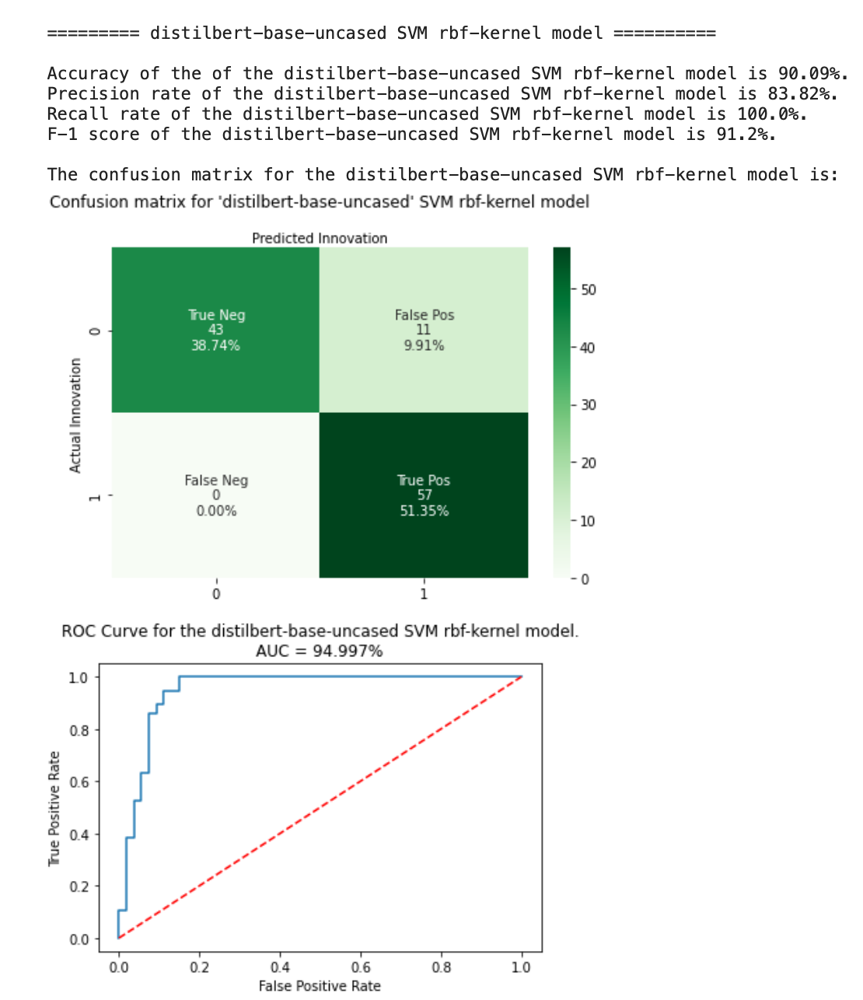
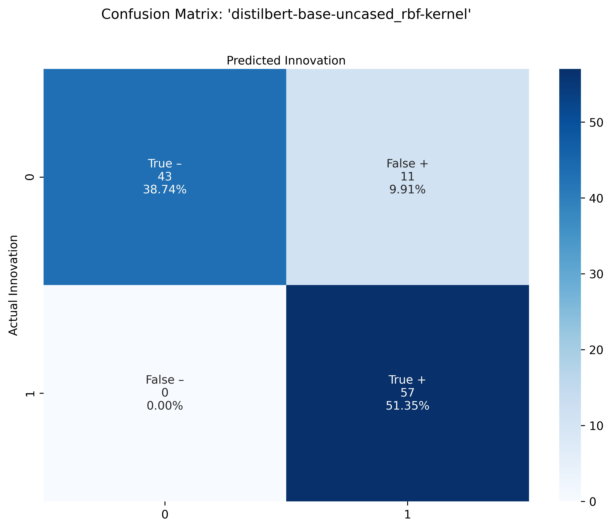
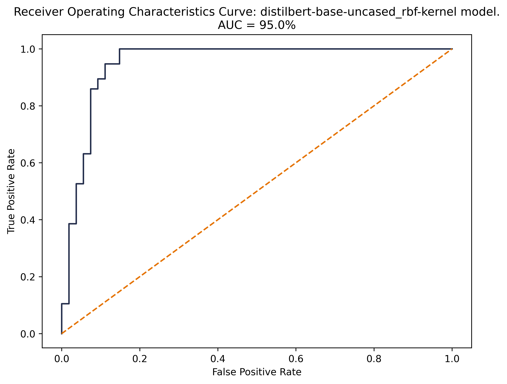
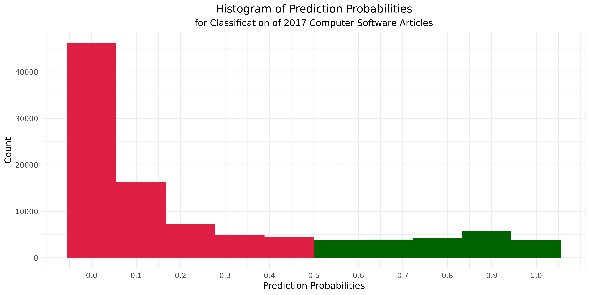
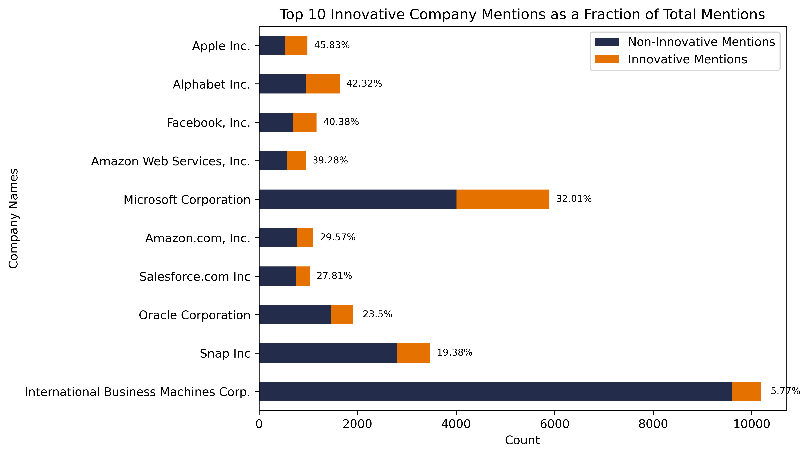
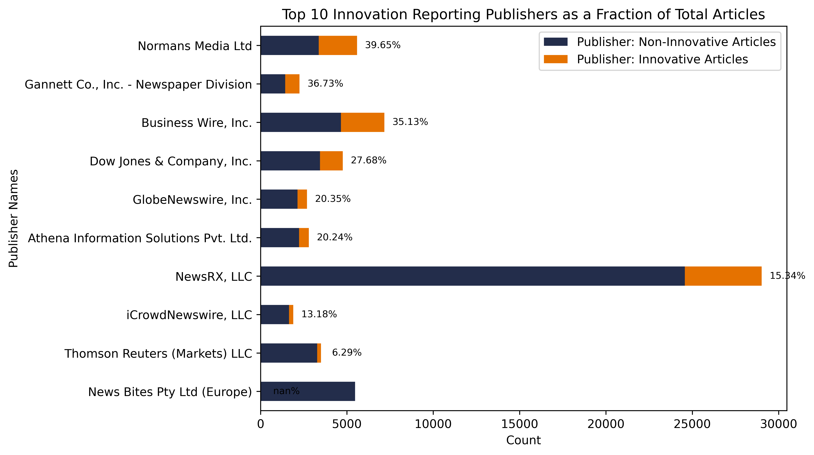

<!--- FOR COLUMNS: From http://stackoverflow.com/questions/31753897/2-column-section-in-r-markdown:
Put in your css file or directly in rmarkdown--->
<style>
  .col2 {
    columns: 2 200px;         /* number of columns and width in pixels*/
    -webkit-columns: 2 200px; /* chrome, safari */
    -moz-columns: 2 200px;    /* firefox */
  }
</style>

----

## **Classification**

### Evaluating Performance of Top-3 Performing Transformer Models  

Our best performing model is the DistilBERT model paired with a Support Vector Machines classifier using an RBF kernel. This model demonstrates the highest performance metrics with a balanced dataset. When cross-validation is used to further test performance with an unbalanced dataset, we find this model also has the best cross-validation score.  


 **Model**                                       | **Accuracy** | **Precision** | **Recall** | **F1** | **Cross-Validation Score** |
|:-----------------------------------------------:|:------------:|:-------------:|:----------:|:------:|:--------------------------:|
| distilbert-base-uncased_SVM_rbf-kernel          | 90.09        | 83.82         | 100        | 91.2   | 85.97   
| distilbert-base-uncased_logistic regression     | 87.39        | 83.08         | 94.74      | 88.52  | 82.47                      |                   |
| google/bigbird-roberta-base_logistic regression | 85.59        | 82.54         | 91.23      | 86.67  | 81.63                      |

<br>

We make use of a balanced dataset of 222 observations in each of our "yes" and "no" target classes for calculating the accuracy, precision, recall, and F-1 score. We split this dataset having 444 total observation into a training set containing 333 observations and a testing set containing 111 observations, respectively (*train-test-split = 75% train - 25% test*). For cross-validating our models, we made use of the entire unbalanced dataset of 600 observations. We effectively had 222 observations for the "yes" class 378 observations for the "no" class.  

----

### ROC Curves and Confusion Matrices  

Our 3 ROC curves reinforce the findings of our performance metrics above. Our DistilBERT model, paired with the Support Vector Machine classifier, shows the strongest performance in terms of Area Under the Curve (AUC). The DistilBERT-SVM model exhibits the best AUC at 95%, as compared with 90% and 88% with the DistilBERT-Logistic Regression and Big Bird-Roberta models respectively. Furthermore, we observe that the slope of the curve itself is strongest for the DistilBERT-SVM model where the curve shows the steepest, immediate rise over long run, indicating the model's develops the ability to distinguish between innovation text and non-innovation text much more quickly. 

#### Distil-BERT Support Vector Machine (RBF Kernel)  
 
<div class="col2">

<!--  -->



<br>
<br>



</div>

#### Distil-BERT Logistic Regression  

<!--  -->

<div class="col2">


<br>
<br>


</div>

#### BigBird Logistic Regression  

<!--  -->

<div class="col2">


<br>
<br>


</div>

There are some interesting results in our three models' confusion matrices. Firstly, we observe that each model's TN and FP counts are identical. For the TP and FN counts, we observe the following ranking:  

1. DistilBERT-SVM shows best TP-FN tradeoff with 0 FNs,
2. DistilBERT-LR shows next best tradeoff with 3 FNs,
3. Big Bird RoBERTA-LR shows worst performance in terms of TP-FN trade off with 5 FNs.  

Looking at the distilbert SVM confusion matrix, we see improvement from the first distilbert logistic regression confusion matrix, as 3 FN’s move into TP’s. Lastly, the Big Bird Roberta Logistic Regression confusion matrix seems to perform worse, compared to the first distilbert logistic regression confusion matrix, as it shows an extra 2 FN’s that seem to move from the TP’s.  

----

## **Named Entity Recognition**

* dslim results
* expecting that we have some overall accuracy number - compare the # companies we manually labeled to the companies identified by NER
* if we had tagged Apple, MCRSFT, is there a match for those based on NER? 

Our team first ran Named Entity Recognition (NER) on a subset of our training set data, the 222 articles we labeled as “yes” innovation. The NER pipeline worked using the “dslim-bert-base” model and we compared its results to the company names that we had hand-labeled when classifying our training data. 

Specifically, we ran each article through NER, and extracted the words that the model categorized as an organization, with the “ORG” tag, within the article. Along with the words themselves, we also extracted the confidence score associated with each word; this score indicates how confident the model is in its word recognition being correct. 

Having all of the entities that the model “guessed” as organizations for a particular article, we then compared the model’s most confident guess, the one with the highest confidence score, to the name we had hand-labled when classifying our training data. Moreover, this was an exact string match in which the model’s guess was only considered correct if it was exactly the same as our hand-labeled company name.

Using these methods and the “dslim-bert-base” model for NER, we saw an accuracy of 50.90%, the model correctly matched the company name in 113 of 222 innovative articles.

Here are 4 articles and the NER predictions and accuracy associated with them:

```{r}
ner_res <- dplyr::slice(readxl::read_excel("images/NER_results_sample.xlsx"), 2:5 )

knitr::kable(ner_res)
```


----

## **2017 Set Results**

### Classification  

  

### NER  

<!-- <div class="col2"> -->




<!-- </div> -->


----

## **Conclusion**  

In conclusion, promising results in terms of leverage state of the art language represetntation models to identify articles relevant to innovation. We have successffuly constructed a pipeline that classifies articles and extracts innovator companies with high accuracy and reasonable confidence. As a result of this work, we/NSF can now...

Drawbacks/Weaknesses: 

* susceptible to bias  e.g., because of large companies with large PR budgets overrepresented in the data
* susceptible to noise e.g., financial news, irrelevant news
* scaling is a challenge - need for labeled data, crossing sectors is difficult, crossing time may be more complex as well

Next steps, to refine this pipeline, extract product names, implement alt approaches e.g. Q&A, perform deduplication on company names

* 

This summer’s work has yielded promising results in terms of leveraging state-of-the-art language representation models to identify articles relevant to innovation. We have successfully constructed a pipeline that classifies articles and extracts innovative companies with high accuracy and reasonable confidence. As a result of this work, our team and the NCSES team can analyze innovation patterns frequency within the computer software sector through a new, quantitative perspective. Our work allows for the comparison of innovation rates between companies, specific differences between innovation identified by BERD and by our model, and countless other lenses with which to study this data. 

Our research and results are susceptible to some influence due to the nature of our data, the context of which should be considered when performing further analysis and making conclusions based on the data. This can present itself in different ways: bias may come about through disparities in companies’ PR budgets, causing them to be overrepresented in the data; irrelevant news or “noise” can filter through into the data, lowering the rate of innovation in the entire dataset; and certain publishers may be overrepresented in the media, causing them to skew company-name frequency in the dataset and results. Scaling is also a challenge within this project -- the research demands hand-labeled data prior to model application, and crossing sectors or crossing time periods will only add complexity to the project. 

Building off this summer’s results, our next steps will include refining and fine-tuning our natural language processing pipeline and moving from company-name extraction into product-name extraction using named-entity recognition. We plan to look into alternate NER approaches, such as question-answering (Q&A) models (which can be tested at the demo on our “Methods” page).