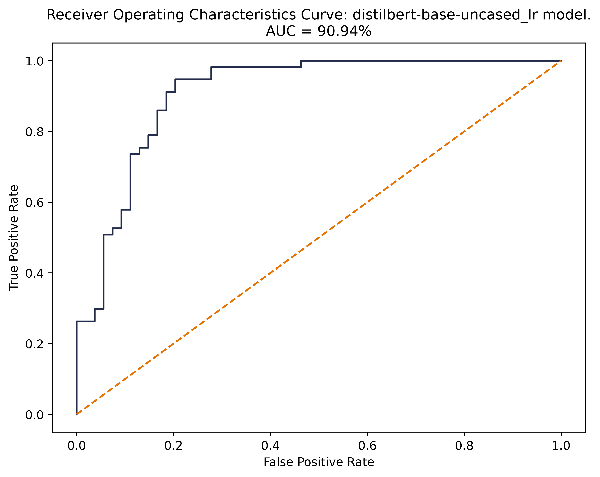
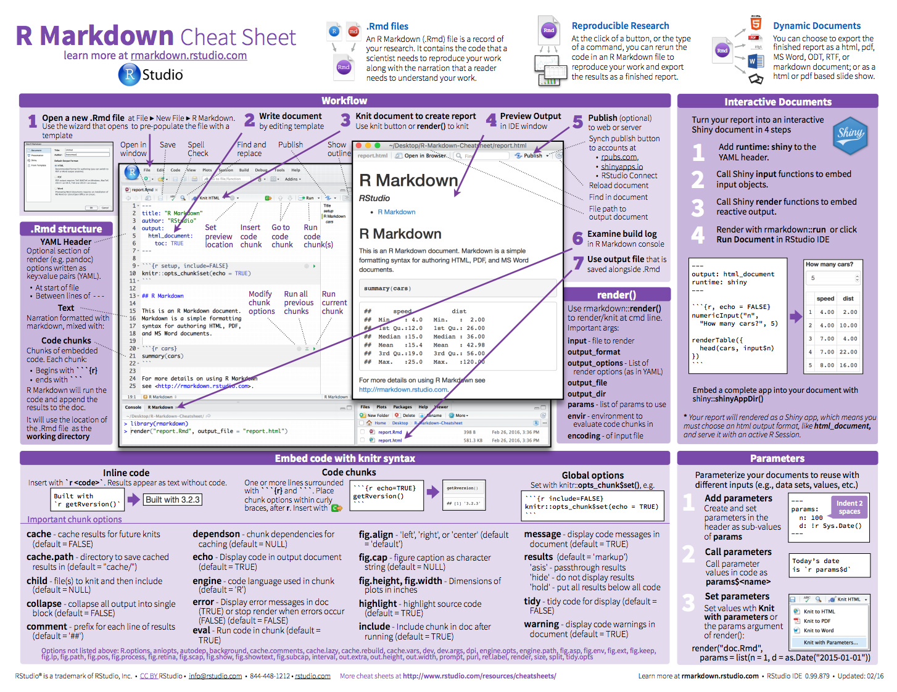

<!--- FOR COLUMNS: From http://stackoverflow.com/questions/31753897/2-column-section-in-r-markdown:
Put in your css file or directly in rmarkdown--->
<style>
  .col2 {
    columns: 2 200px;         /* number of columns and width in pixels*/
    -webkit-columns: 2 200px; /* chrome, safari */
    -moz-columns: 2 200px;    /* firefox */
  }
</style>

----

## Summary of Results: Evaluating Performance

table: 

* what cross-validation we did
* comments on which model performs best in terms of what metrics
    - accuracy (what this means - overall)
    - F1 score (what this means - mean, tradeoff, prec/rec)

plots: 

* comments on performance    
    - AUC 
    - all 3 models seem to have the same # of TN, FP, same base # of TP
    - Dif 1: 3 False negs move into True pos from DB-LR to DB-SVM
    - Dif 2: BBR has an additional 2 FN that move from the TP pile 

### Classification Training Set Results

 **Model**                                       | **Accuracy** | **Precision** | **Recall** | **F1** | **Cross-Validation Score** |
|:-----------------------------------------------:|:------------:|:-------------:|:----------:|:------:|:--------------------------:|
| distilbert-base-uncased_logistic regression     | 87.39        | 83.08         | 94.74      | 88.52  | 82.47                      |
| distilbert-base-uncased_SVM_rbf-kernel          | 90.09        | 83.82         | 100        | 91.2   | 85.97                      |
| google/bigbird-roberta-base_logistic regression | 85.59        | 82.54         | 91.23      | 86.67  | 81.63                      |

<br>

Cross-validation is a statistical method used to estimate the skill of machine learning models. This summer, we used a method of cross-validation known as “k-fold” to evaluate the skill of our BERT + classifier models, where k=10. In 10-fold cross validation, a given data set is split into 10 sections where each section/fold is used as a testing set at some point. In the first iteration, the first fold is used to test the model and the rest are used to train the model. In the second iteration, 2nd fold is used as the testing set while the rest serve as the training set. This process is repeated until each fold of the 10 folds have been used as the testing set.

*Accuracy:* Accuracy is the fraction of predictions that our model got right. Our support vector model employing the distilbert-base-uncased transformer performed with the highest accuracy across models.
 
*F1 score:* The F1 score is another measure of a model’s accuracy, calculated as the harmonic mean of the model's precision and recall. The highest possible value of an F-score is 1.0, indicating perfect precision and recall, and the lowest possible value is 0. Our support vector model employing the distilbert-base-uncased transformer performed with the highest F1 score across models.

<br>
<br>

<div class="col2">

#### **ROC Curves** 

#### **Confusion Matrices** 

</div>

Distilbert LR

<!--  -->

<div class="col2">




<br>
<br>


</div>


Distilbert SVM
 
 <div class="col2">

<!--  -->


<br>
<br>


</div>

Big Bird Roberta LR

<!--  -->

<div class="col2">


<br>
<br>


</div>

### NER Training Set Results

* dslim results
* expecting that we have some overall accuracy number - compare the # companies we manually labeled to the companies identified by NER
* if we had tagged Apple, MCRSFT, is there a match for those based on NER? 


### 2017 Set Results

* classification prediction histogram of pred_prob (highlight green for > 0.5)

* NER - top 10 innovators
    - can we add %ages to the bars here for innovative mentions/all mentions


* visualization of co-mentions of innovators


## Takeaways

The confusion matrices pictured above for each model provide insight with regards to exactly how each model classified articles correctly and incorrectly, by displaying predictions by their type: True negatives (TN), False positives (FP), and False negatives (FN), True Positives (TP).

Looking at the three model’s confusion matrices, we can make some rather interesting comparisons. Namely, while we cannot be sure that each model is making predictions on the same articles, the first row of TN’s and FP’s are identical across all models - 43 TN’s and 11 FP’s.

Looking at the distilbert SVM confusion matrix, we see improvement from the first distilbert logistic regression confusion matrix, as 3 FN’s move into TP’s.

And lastly, the Big Bird Roberta Logistic Regression confusion matrix seems to perform worse, compared to the first distilbert logistic regression confusion matrix, as it shows an extra 2 FN’s that seem to move from the TP’s.


----
----
----

These are options that you can do from the Front Matter. 

<br>

### Table of Contents

Note that on this page: 

1. there is a Table of Contents (TOC) there on the left, and 
1. it is floating (i.e. it follows you as you scroll down and expands/collapses nicely as you click)
1. This is all done in the front matter:  
```
    output:  
      html_document:  
        toc: true  
        toc_float: true  
```  
<!---also note that my numbering in this list renders nicely--->

<br>

### Themes

We can change the website's theme in `_site.yml`. Explore options here: <http://rmarkdown.rstudio.com/html_document_format.html#appearance_and_style>:

>Valid themes include "default", "cerulean", "journal", "flatly", "readable", "spacelab",  "united", "cosmo", "lumen", "paper", "sandstone", "simplex", and "yeti". 


----

## Simple styling


### images

By default, images are displayed left-aligned. 

**Resize** an image using HTML tags (side note: check out [RStudio's R Markdown Cheatsheet](https://www.rstudio.com/resources/cheatsheets/)):

Here's a big image:  
``  


And a small image:   
``  


  
**Align** an image using HTML tags: 

Small image centered:  
`<center></center>` 

<center></center>

Small image right-aligned:   
`<div align="right"></div>`

<div align="right"></div>

<br> 


 
 


<br>

<center>
`<center>**Here the text is centered. Here are good resources:**</center>`  
**Here the text is centered. Here are good resources:**

• [w3schools.com - HTML references](http://www.w3schools.com/tags/) • [w3schools.com - CSS tutorial](http://www.w3schools.com/css/) • 
</center>

<br>

### colored text

`<font size="3" color="red">Text here!</font>`

<font size="3" color="red">This is red text size 3!</font>  
<font size="2" color="blue">This is blue text size 2!</font>  
<font face="verdana" color="green">This is green text in verdana!</font>

---- 

## `R` code

You can execute R code each time you build your website. Even if you don't yet know R, this is a little taste of the types of things you can do. There are two ways you'll see R code; in-line and in a code chunk. This is from the [R Markdown chapter in R for Data Science](http://r4ds.had.co.nz/r-markdown.html).


<br>

### in line

Here is an example inline. The date when I last built the website is `r Sys.Date()`. My favorite number is `r pi + 10`. There are `r length(list.files())` files and folders in our repo. This is not just text; his is executable R code that is `r 10 * 10`% awesome!

<br>

### in a code chunk

And here is an example of a code chunk. Let's plot the first bit of an `iris` variable (which is a dataset that comes with base R). 

```{r plot iris}
x <- iris$Sepal.Length[1:15]
plot(x)
```

### calling another file 

#### `R` script

You can source an R script. This is a super powerful way to avoid copy-pasting your analyses. For example: 

```{r source gdp script, echo=T, warning=FALSE, message=F}
## source an external script 
source("advanced/my_script.R")

## use the calc_gdp() function `my_script.R`
my_data <- calc_gdp(my_country <- 'Slovenia')

ggplot(data = my_data, aes(x = year, y = pop)) + 
  geom_point() + 
  labs(title = my_data$country)
```

<br>

#### A specific R script: `_site.R`

This is something that R Markdown websites will look for; when it exists it will give you 'global variables' that will be available for all pages across your site.

```{r _site.R, eval=FALSE, warning=FALSE, message=F}
source("_site.R")
```
 
<br>

#### R Markdown file 

You can insert separate R Markdown files too; text and code will be incorporated seamlessly into this page. This R Markdown file is considered the 'parent' file, and the one that is incorporated is the 'child' file. In the code chunk below, we'll say `{r, child='advanced/important_example.Rmd'}`. 

```{r child, child='advanced/example.Rmd'}
```
 
<br>

## Troubleshooting

You'll get errors as you work; this is how you learn. These are a few things you may encounter: 

1. If when running `rmarkdown::render_site()` you get this error: 

    ```
    Error in object[seq_len(ile)] : 
    object of type 'symbol' is not subsettable
    ```
Go to *Session > Restart R* and try again. 

2. When knitting, if you get this error: 

    ```
    Error in parse_block(g[-1], g[1], params.src) : duplicate label 'setup'
    Calls: <Anonymous> ... process_file -> split_file -> lapply -> FUN -> parse_block
    Execution halted
    ```
Here you have 2 `R` code chunks named the same thing (in this case 'setup'), you must change one of them because there cannot be two code chunks with the same name.


3. When you get an error message you don't understand: Copy-paste it into Google.

<center></center>
  

